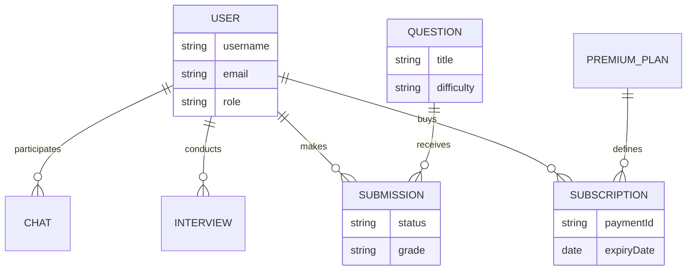

# ER Diagram Documentation & Structure

Ye file me aapki database architecture ki puri details he. ER diagram banane ke liye niche di gayi information use kare.

## 1. Shapes and Symbols (Kyo or Konsa Shape?)

| Element Type | Shape | Meaning |
| :--- | :--- | :--- |
| **Entities (Tables)** | **Rectangle** | Saari main tables (User, Question, etc.) rectangle me aayegi. |
| **Attributes (Fields)** | **Oval (Ellipse)** | Table ke andar ke fields (name, email) oval me aayenge. |
| **Relationship** | **Diamond** | Do tables ke bich ka connection diamond shape se dikhaya jayega. |
| **Primary Key** | **Underlined Text** | Har table ki uniqe ID ya main field underline hoga. |

---

## 2. Table Connections (Kiske sath kiska relation he?)

| Connection | Relationship Type | Logics / Description |
| :--- | :--- | :--- |
| **User <-> Chat** | 1 : N (One-to-Many) | Ek User ke pass bahut saari chats aur messages ho sakte he. |
| **User <-> Interview** | 1 : N (One-to-Many) | Ek User (Interviewer ya Candidate) multiple interviews me part le sakta he. |
| **User <-> Submission** | 1 : N (One-to-Many) | Ek Student (User) bahut saare coding questions submit kar sakta he. |
| **User <-> Subscription** | 1 : N (One-to-Many) | Ek User multiple plans kharid sakta he (History ke liye). |
| **Question <-> Submission** | 1 : N (One-to-Many) | Ek Question ke liye many different users answers submit kar sakte he. |
| **PremiumPlan <-> Subscription** | 1 : N (One-to-Many) | Ek Plan (Gold/Silver) multiple subscriptions me refer kiya jayega. |
| **User <-> RefreshToken** | 1 : N (One-to-Many) | Ek User ke multiple device logins ho sakte he. |

---

## 3. ER Diagram Prompt (For AI Tools)

Copy this prompt to get a professional diagram:

> "Create a professional ER Diagram using Chen's notation (Rectangles for Entities, Diamonds for Relationships, Ovals for Attributes). 
> 
> **Entities & Fields:**
> - User [Rectangle]: username, email, role, status
> - Question [Rectangle]: title, difficulty, category, isPremium
> - Submission [Rectangle]: code, status, grade, runtime
> - Subscription [Rectangle]: paymentId, amount, status, expiryDate
> - Interview [Rectangle]: roomId, status
> - PremiumPlan [Rectangle]: name, price, duration
> 
> **Relationships [Diamonds]:**
> - User 'Participates' in Chat
> - User 'Conducts/Attends' Interview
> - User 'Makes' Submission
> - User 'Purchases' Subscription
> - Question 'Has' Submission
> - PremiumPlan 'Defines' Subscription
> 
> Use Crow's Foot notation for cardinality (1:N) and ensure all foreign keys are linked correctly."

---

## 4. Mermaid Code (MD Preview)

Aap is code ko kisi bhi Markdown viewer me dekh sakte he:

